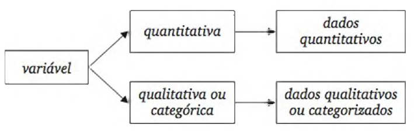
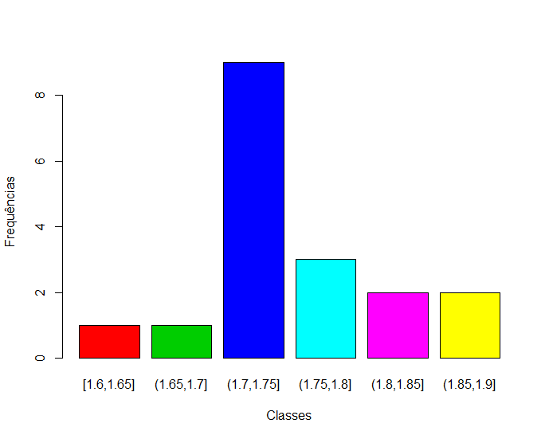
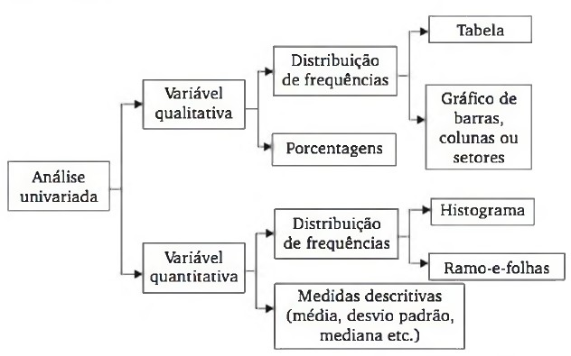

# Análise Exploratória de Dados

```{r message=FALSE, warning=FALSE, echo=FALSE}
library(qcc)            #biblioteca para a função pareto
library(gmodels)        #biblioteca para a função CrossTable
```

## Objetivos{-}

- Organizar e descrever conjuntos de dados;

-	Descrever tendências, medidas centrais e de variação;

-	Representar os dados graficamente.


## Conceitos iniciais

### Estatística, população, censo e amostra{-}

- A **Estatística** é a ciência que se ocupa da **obtenção de informação** (amostragem, planeamento de experiências), do seu **tratamento inicial** (ordenação, cálculo de características amostrais, agrupamentos em classes, construção de tabelas, representações gráficas) com a finalidade de **inferir de uma amostra para a população** (decisão sobre hipóteses, estimação de parâmetros populacionais) e eventualmente **prever a evolução**  de um fenômeno (previsão).

- Podemos afirma que a Estatística é a ciência que nos guia na tomada de decisões em situação de incerteza.


- **População** designa o conjunto dos elementos cujas características (atributos) são objetos de um determinado estudo.

- Os elementos da população são designados por **unidades estatísticas**.

- Para conhecer de forma completa uma população tem de 	analisar-se todos os seus elementos, ou seja, realizar um **censo**.

- O estudo das características da população pode ser feito sobre um subconjunto finito que se designa por **amostra**.


## Análise Exploratória de Dados

	 
- Para que os dados sejam informativos, necessitamos organizá-los, resumi-los e apresentá-los de forma adequada. Este é o papel da **estatística descritiva**.
  
  
- Na **análise exploratória de dados**, além de descrever os dados, buscamos conhecer algumas características do processo com base nos dados. 

- Com o uso adequado de **tabelas**, **gráficos** e **medidas**, podemos descobrir certas estruturas que não eram evidentes nos dados brutos. 

		
- A **mineração de dados** (*data mining*) significa a busca por relacionamentos não triviais, que podem estar escondidos em grandes massas de dados. 

		
- A mineração de dados aplica **técnicas estatísticas e computacionais**.
	 


### Dados e Variáveis

	 
- Depois de realizado um levantamento de dados, eles são colocados em arquivos, sob a forma de matrizes, em que: 

- As linhas correspondem ao que se observou em cada elemento pesquisado;

- As colunas correspondem às características (variáveis) levantadas.

- Os dados podem ser observações de variáveis **qualitativas** ou **quantitativas.**
		
    - **Quantitativa:** os possíveis resultados são números de certa escala. 
		
    - **Qualitativa:** os possíveis resultados são atributos ou qualidades.
	 




### Classificação das Variáveis
	
	 
- **Qualitativas** ou **categóricas:** assumem um conjunto de categorias.
		 
  - Nominais: masculino/feminino, certo/errado.
  - Ordinais: primeiro, segundo, ... décimo.
  
			
- **Quantitativas:** assumem um conjunto de valores numéricos que se apresentam numa escala de intensidades ou valores.

		 
  - **Discretas:** podem tomar um número finito ou uma infinidade numerável de valores.
			
    ``50; 10; 8; 70; ...``

  - **Contínuas:** podem tomar qualquer valor dentro de um intervalo de números reais.
			
    ``3,1415...; 34,172; 75,36; ...``
		 
	 

- Ao observar os valores que essas características assumem (seja na amostra, seja em toda a população), definem-se as **variáveis**, uma para cada característica.


- Perante uma amostra de **dimensão** $n$, e representando-se uma variável por $x$, tem-se
  $$ X_1, X_2, \dots X_n $$
		
- em que $x_i, (i = 1, \dots, n)$ é o valor da característica observada na $i_{\text{ésima}}$ **unidade estatística**.
	


## Preparação dos dados

As técnicas utilizadas para preparar os dados envolve o **arranjo** desses dados em subconjuntos que apresentem características similares.
 
- mesma idade, mesma finalidade, mesma faixa salarial, mesmo grau de instrução.
 
Os dados agrupados podem ser apresentados em tabelas e/ou gráficos para obter as **estatísticas descritivas:**
 
- média, mediana, desvio padrão...
 
A essa organização dos dados em grupos, classes, categorias, são chamados de **distribuição de frequência**.		


### Representação dos dados

**Distribuição de Frequências:**
 
- Frequência absoluta ($F_a$);

- Frequência absoluta Acumulada ($F_aA$);

- Frequência relativa ($F_r$);

- Frequência relativa Acumulada ($F_rA$).
 

**Representação gráfica:**
 
- Histograma;
- Gráfico de Dispersão;
- Gráfico de colunas/barras;
- Gráfico de pizza.


### Distribuição de frequência
	
 
- Distribuição de frequência é o método de agrupar os dados em **categorias** para fornecer a quantidade ou percentagem dos dados em cada categoria.

	
- Podemos **resumir** e visualizar um conjunto de dados sem a necessidade de levar em conta os valores individuais.

- A distribuição de frequência pode ser relativa ou absoluta, podendo ser representada em **gráficos** ou **tabelas**.

- A distribuição de frequência é utilizada para **representar**, de forma resumida, uma grande quantidade de dados para análise.


**Exemplo 1:** Análise de Variáveis Qualitativas/Categóricas
	 
- Numa pesquisa, levantou-se algumas características dos visitantes de um site, tais como o sexo, a idade, o nível de instrução e o provedor utilizado. 

- Consideraremos apenas uma amostra de 40 pessoas.
	 
```{r}
provedor <- c('C', 'A', 'B', 'B', 'C', 'B', 'D', 'B', 'B', 'A', 'C', 'A', 
        'B', 'D', 'A', 'B', 'B', 'C', 'D', 'B', 'B', 'A', 'A', 'B', 'A', 
        'A', 'B', 'D', 'D', 'C', 'A', 'A', 'B', 'C', 'B', 'D', 'B', 'B', 'B', 'C')

```
- Realizar a distribuição de frequência absoluta com a função *table* (contar o número de ocorrência de cada provedor) ``table(provedor)``.

```{r echo=FALSE}
table(provedor)
```

- Gerar o gráfico de barras com a função *barplot* ``barplot(table(provedor), col = 2:5)``.

```{r echo=FALSE}
barplot(table(provedor), col = 2:5)
```

- Gerar as distribuições de frequências e o gráfico com a função *pareto.chart*. Essa função gera um gráfico de barras com as frequências absolutas e um gráfico de linha com a frequência relativa acumulada, além de gerar uma tabela com as distribuições absoluta, absoluta acumulada, relativa e relativa acumulada.

```{r echo=FALSE}
knitr::kable(qcc::pareto.chart(table(provedor), plot = F, col = c(3,2,4,5)))
```

- Gerar o gráfico de Pareto ``qcc::pareto.chart``.

```{r echo=FALSE}
grafico <- qcc::pareto.chart(table(provedor), plot = T, col = c(3,2,4,5))
```


- Gerar o gráfico de pizza com a função *pie*.

```{r echo=FALSE}
pie(x = table(provedor), col = 2:5)
```


### Exercício 1: Análise Exploratória de Dados

<div style="width:50px; height:50px">

</div>

Numa pesquisa de mercado para verificar a demanda da qualidade no desenvolvimento de um software, indagou-se qual dos seguintes itens era considerado mais importante:

OP|VARIÁVEL|VALOR|OP|VARIÁVEL|VALOR
:-:|---|:-:|:-:|---|:-:
(a) | interface de fácil acesso 	    | 8 | (b) | desempenho do sistema    | 7 
(c) | métodos de análise avançados 	  | 7 | (d) | método de custeio        | 12
(e) | manutenção e suporte 			      | 2 | (f) | personalização           | 4 
(g) | atualização em tempo real       | 3 | (h) | confiabilidade das informações   | 21 
(i) | segurança dos dados             | 6 | (j) | uso de novas tecnologias de informática | 0 


- A variável demanda da qualidade no desenvolvimento de um software, operacionalizada de acordo com a pergunta, é qualitativa ou quantitativa?

- Construa um gráfico (ou diagrama) que mostre a distribuição de frequências das respostas, priorizando os itens segundo a frequência de respostas. 

- Qual o nome que se dá a esse diagrama?


#### Exemplo 2: Distribuição de frequência{-}

Neste exemplo serão analisadas as alturas de 18 alunos.

``dados <- c(1.60, 1.69, 1.72, 1.73, 1.74, 1.75, 1.75, 1.75, 1.75,
           1.75, 1.75, 1.76, 1.78, 1.80, 1.82, 1.83, 1.88, 1.90)``

```{r echo=FALSE}
dados <- c(1.60, 1.69, 1.72, 1.73, 1.74, 1.75, 1.75, 1.75, 1.75,
           1.75, 1.75, 1.76, 1.78, 1.80, 1.82, 1.83, 1.88, 1.90)

n <- length(dados)

k = ceiling(1 + 3.3 * log10(n))

L = diff(range(dados))

h = L/k

```
- Tamanho da amostra ``length(dados)``: $n=$ `r length(dados)`

- Número de classes ``ceiling(1 + 3.3 * log10(n))``: $k=$ `r ceiling(1 + 3.3 * log10(n))`

- Amplitude dos dados ``diff(range(dados))``: $L=$ `r diff(range(dados))`

- Amplitude da classe ``L/k``: $h=$ `r L/k`

- Tabela de frequências:
``(freq = table(cut(dados, breaks = k, include.lowest = T, right = T)))``

```{r echo=FALSE}
(freq = table(cut(dados, breaks = k, include.lowest = T, right = T)))
```

- Gráfico de barras:
``barplot(freq, col = 2:7, xlab = "Classes", ylab = "Frequências")``

```{r echo=FALSE}
barplot(freq, col = 2:7, xlab = "Classes", ylab = "Frequências")
```

- Tabela e gráfico de Pareto:
``round(pareto.chart(data = freq, plot = T), 2)``

```{r echo=FALSE}
round(pareto.chart(data = freq, plot = T), 2)
```


### Exercício 2: Análise Exploratória de Dados

```{r echo=FALSE}
x <- c(1, 2, 0, 3, 2, 1, 1, 0, 6, 1, 0, 4, 0, 0, 3,
       1, 1, 3, 0, 2, 1, 1, 1, 2, 1, 2, 4, 0, 0, 0)
length(x)

min(x)
max(x)

table(x)
CrossTable(x)

(freq = table(cut(x, breaks = 7, include.lowest = T, right = T)))

barplot(freq, col = 2:8, xlab = "Classes", ylab = "Frequências")

round(pareto.chart(data = freq, plot = T, col = 2:8), 2)
```


**Regras para determinar a quantidade de classes (k)**	

- Regra de Sturges (logaritmo)

$$k = 1 + 3,3 log_{10}(n)$$
	
- Regra da potência de base 2 ($log_2$)

$$k = \text{ menor valor inteiro tal que } 2^k \geq n$$

		
- Regra da raiz quadrada

$$k=sqrt(n)$$

- Regra do bom senso

A quantidade de classes deve garantir observar a distribuição de valores.
	 


## Distribuição de frequência

### Regra de Sturges (Logaritmo){-}

Quantidade de Dados (n)} | Quantidade de Classes (k)
:--:|:--:
1       | 1 
2       | 2 
3 a 5   | 3 
6 a 11  | 4 
12 a 23 | 5 
24 a 46 | 6 
47 a 93 | 7 
94 a 187  | 8 
188 a 376 | 9 
377 a 756 | 10 


### Regra da Potência de 2{-}

Quantidade de Dados (n) | Quantidade de Classes (k)
:--:|:--:
		1 e 2 | 1 
		3 e 4 | 2 
		5 a 8 | 3 
		9 a 16 | 4 
		17 a 32 | 5 
		33 a 64 | 6 
		65 a 128 | 7 
		129 a 256 | 8 
		257 a 512 | 9 
		513 a 1024 | 10 


### Regra do BOM SENSO{-}

Quantidade de Dados (n) | Quantidade de Classes (k) mín-máx 
:--:|:--:
		até 50 | 5 a 10 
		51 a 100 | 8 a 16 
		101 a 200 | 10  a 20 
		201 a 300 | 12 a 24 
		301 a 500 | 15 a 30 
		mais de 500 | 20 a 40 

	
-	No exemplo em estudo, temos: $n = 18$


### Exemplo 2: Determinando as características da classe


- Amplitude do conjunto de dados: $L = x_{max} - x_{min}$

- Amplitude da classe: $h = L / k$

- Limites das classes: 
  - 1ª classe: $x_{min}$ até $x_{min} + h$ 
  
  - 2ª classe: $x_{min}+h$ até $x_{min} + 2 * h$ 
  
  $\dots$ 
  
  - kª classe: $x_{min} + (k-1) * h  \text{ até }  x_{min} + k * h$
 

#### Cálculos	para a definição das classes:{-}
	
- $n = 18$
	
- $k = 1 + 3,3 * log10(18) = 5,14 ; k=6$
	
- $L = 1,90 - 1,60 = 0,30; L = 0,30$
	
- $h = 0,30 / 6 = 0,05; h = 0,05$

- $min = 1,60$

- $max = 1,90$

**Dados ordenados:**

**1,60 1,69 1,72 1,73 1,74 1,75 1,75 1,75 1,75 1,75 1,75 1,76 1,78 1,80 1,82 1,83 1,88 1,90**

	
Classes | Limites | Frequências
:--:|:--:|:--:
1ª classe | $[1,60;1,65]$ |	1	
2ª classe | $(1,65;1,70]$ |	1	
3ª classe | $(1,70;1,75]$ |	9	
4ª classe | $(1,75;1,80]$ |	3	
5ª classe | $(1,80;1,85]$ |	2	
6ª classe | $(1,85;1,90]$ |	2	
 
	


#### Notação para indicar os limites das classes:{-}

- $[x, y)$ intervalo fechado em $x$ e aberto em $y$ 
		
	[x pertence ao intervalo, y não pertence ao intervalo). 

- Frequentemente temos que arredondar a amplitude das classes e, consequentemente, os limites das classes.

- Sugere-se um ajuste simétrico nos limites das classes das pontas (primeira e última) nas quais a quantidade de dados pode ser menor.

- Ponto médio das classes: 
		$$x_k = L_{inferior} + (L_{superior}-L_{inferior})/2$$
	 


#### Representação gráfica:{-}




### Organização dos dados - definições
	 
- O método experimental obriga recolher grandes quantidades de dados.

- Não basta colecionar dados; é fundamental organizá-los, proceder ao seu tratamento, armazenamento e apresentação. 

- Perante uma coleção numerosa de dados, torna-se necessário recorrer às chamadas **distribuições de frequências**.

- Comecemos por analisar o caso em que os valores de determinada característica podem ser descritos por uma variável **discreta**.
		
- Ordenando os dados $x_1, x_2, \dots , x_n$ por ordem crescente, obtém-se:

$$x_{(1)}, x_{(2)}, \dots, x_{(n)}$$
		
- em que $x_{(i)}$ é a $i_{\text{ésima}}$ observação ordenada por ordem crescente.
		
Tem-se, assim: 		
$x_{(1)} = \qquad \qquad x_{(n)} =$
		
	 


\begin{frame}{\textit{Organização dos dados - definições}}
	Seja $ x_1 \leq \dots \leq x_k $, $ k $ observações distintas na amostra de dimensão $ n $.\\
		\vskip 0.3cm
	
	Geralmente definem-se os seguintes tipos de frequências:

	 
		- Frequências absolutas $ (n_i) $: número de vezes que o valor $ x_i $ é observado na amostra.
		
		- Frequências absolutas acumuladas: soma das frequências absolutas até o ponto observado.	
		$$ N_i = n_1 + n_2 + \dots + n_i $$
		
		- Frequências relativas $ (f_i = \frac{n_i}{n}) $: proporção de valores iguais a $ x_i $ na amostra.
		
		- Frequências relativas acumuladas: soma das proporções relativas até o ponto observado.
		$$ F_i = f_1 + f_2 + \dots + f_i	$$
		
	 
\end{frame}


### Distribuições de frequências

Constrói-se a tabela de frequências:
	

$X_i$  |$n_i$  | $N_i$  | $f_i$  | $F_i$ 
:--:|:--:|:--:|:--:|:--:
$X_1$  | $n_1$  | $N_1$  | $f_1$  |$ F_1$ 
$X_2$  | $n_2$  | $N_2$  | $f_2$  |$ F_2$ 
.     | .     | .     | .     | . 
.     | .     | .     | .     | . 
.     | .     | .     | .     | . 
$X_k$  | $n_k$  | $N_k=n$ | $f_k$  | $F_k=1$ 
| $\Sigma^k_{i=1} n_i=n$ |       | $\Sigma^k_{i=1}f_i=1$ |  


### Exercício 2: Análise Exploratória de Dados (R)

Ao longo de 30 dias registou-se o número de paragens por dia nos computadores de um centro de cálculo:

``x <- c(1, 2, 0, 3, 2, 1, 1, 0, 6, 1, 0, 4, 0, 0, 3,
       1, 1, 3, 0, 2, 1, 1, 1, 2, 1, 2, 4, 0, 0, 0)``
       
`r x <- c(1, 2, 0, 3, 2, 1, 1, 0, 6, 1, 0, 4, 0, 0, 3,
       1, 1, 3, 0, 2, 1, 1, 1, 2, 1, 2, 4, 0, 0, 0)`


**Tem-se:**

- Dimensão da amostra ``length(n)``: $n =$ `r length(x)`
  
- Menor observação ``min(x)``: $X_1 =$ `r min(x)`

- Maior observação ``max(x)``: $X_{30} =$ `r max(x)`
	


**Tabelas de frequências e representação gráfica:**

 
- Construindo a tabela de frequências, têm-se:

``table(cut(x, breaks = 7, include.lowest = T, right = T)))``

```{r echo=FALSE}
(freq = table(cut(x, breaks = 7, include.lowest = T, right = T)))
```
	


**A representação gráfica para o caso das frequências absolutas:**

``barplot(table(cut(x, breaks = 7, include.lowest = T, right = T)), 
    col = 2:8, xlab = "Classes", ylab = "Frequências")``

```{r echo=FALSE}
barplot(freq, col = 2:8, xlab = "Classes", ylab = "Frequências")
```


- Utilizando a função ``qcc::pareto.chart``:

```{r echo=FALSE}
round(pareto.chart(data = freq, plot = T, col = 2:8), 2)
```


## Variável Contínua

- Quando a variável  $x$ é de tipo **contínua**, o processo é um pouco mais elaborado, uma vez que não faz muito sentido falar em frequências absolutas e nem frequências relativas de valores isolados. 
	

-	Neste caso, é necessário proceder à definição de classes de valores, à contagem das frequências absolutas e ao cálculo das frequências relativas de cada classe.
	

*NOTA: Este procedimento é típico no caso de variáveis contínuas, mas usa-se também no caso de variáveis discretas quando estas assumem um grande número de valores.*	
	


### Construção das Classes{-}

-	As regras na construção das classes dependem da bibliografia seguida. 
	
-	Nesta disciplina, seguir-se-ão estas regras, salvo indicação em contrário:
	
	 
	- As classes não têm pontos em comum.
	
	- O número de classes é calculado usando a regra de Sturges: 
		
		 $$\textit{nº de classes = inteiro-superior } (log_2 n) + 1$$
	
		- Sempre que possível as classes devem ter igual amplitude, dada por: 
		
		$$\textit{ amplitude da classe }  (h) = \frac{X_{n} - X_{1}}{\text{nº de classes}}$$
			
		- Os intervalos são abertos à esquerda e fechados à direita. No entanto considerar o primeiro intercalo fechado à esquerda e à direita.
	 
	


### Exercício 3: Construção das Classes (R){-}
	 
- Uma universidade avalia o seu curso através de um questionário com 50 perguntas sobre diversos aspectos de interesse. 
	
	- Cada pergunta tem uma resposta numa escala de 1 a 5. 
	
	- Para cada aluno é encontrada a nota média e recorrendo a uma amostra de 42 alunos obteve-se:
	 
```{r}
x <- c(4.2, 2.7, 4.6, 2.5, 3.3, 4.7, 4.0, 2.4, 3.9, 1.2, 4.1, 4.0, 3.1, 2.4,
       3.8, 3.8, 1.8, 4.5, 2.7, 2.2, 3.7, 2.2, 4.4, 2.8, 2.3, 1.9, 3.6, 3.9,
       2.3, 3.4, 3.3, 1.8, 3.5, 4.1, 2.2, 3.0, 4.1, 3.4, 3.2, 2.2, 3.0, 2.8)
```


### Tabela de frequências{-}
 
- Tamanho da amostra ``length(x)``: $n=$ `r length(x)` 

-	Amplitude dos dados ``diff(range(x))``: $L =$ `r diff(range(x))`  

- Número de classes ``nclass.Sturges(x)``: $k =$ `r nclass.Sturges(x)`

-	Amplitude da classe ``L/K``: $h =$ `r L/k` 

`r sort(x)`

A Tabela de frequência pode ser obtida com ``freq = table(cut(x, breaks = k, include.lowest = TRUE, right = TRUE))`` ou a indicação de Pareto ``(pareto.data <- round(qcc::pareto.chart(data = freq, plot = F, col = 2:8), 2))``.

```{r echo=FALSE}
k <- nclass.Sturges(x)
(freq = table(cut(x, breaks = k, include.lowest = TRUE, right = TRUE)))

(pareto.data <- round(qcc::pareto.chart(data = freq, plot = F, col = 2:8), 2))

```

### Representação gráfica{-}

O gráfico para representar a distribuição de pode ser plotado utilizando `r barplot(freq, col = heat.colors(k))` ou a representação de Pareto `r pareto.data <- round(qcc::pareto.chart(data = freq, plot = T, col = 2:8), 2)`

```{r, echo=FALSE}
barplot(freq, col = heat.colors(k))

pareto.data <- round(qcc::pareto.chart(data = freq, plot = T, col = 2:8), 2)
```


## Diagrama de ramo e folha

- Em um diagrama de ramo e folha, cada número é separado em um ramo e uma folha (por exemplo, se o número é $4.2$, o dígito 4 formará o ramo e o dígito 2 formará a folha: $4|2$).

- Você deve ter tantas folhas quanto a quantidade de valores no conjunto de dados original e estas devem ter um único dígito. 
		
- Um diagrama de ramo e folha é similar a um histograma, com a vantagem de o gráfico ainda conter os valores originais dos dados. 
		
- Outra vantagem de um diagrama de ramo e folha é que ele fornece uma maneira fácil de ordenar os dados.
	
- É importante incluir uma chave para o diagrama de ramo e folha para identificar os valores dos dados, mostrando 	um valor representado por um ramo e uma folha.

- O comando para exibir o diagrama de ramo e folha é `r stem(x)`.

```{r echo=FALSE}
stem(x)

```


## Resumo




