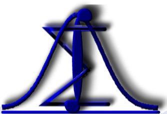

--- 
title: "E S T A T Í S T I C A"
author: "[Antônio Neco de Oliveira, Dr.]()"
date: "`r format.Date(Sys.Date(), '%d/%m/%Y')`"
description: Apontamento para as aulas de Estatística para os alunos do Curso de Tecnologia em Sistemas para Internet.
documentclass: book
github-repo: anecoo/estatistica
link-citations: yes
bibliography:
- book.bib
- packages.bib
site: bookdown::bookdown_site
biblio-style: apalike
---

<!--"Using GitBooks to create Open course materials"-->

# Estatística{-}

Neste página serão publicadas as anotações da disciplina de estatística para acompanhamento dos encontros síncronos.

Para maiores informações o estudante deverá consultar a bibliografia referenciada.

## Ementa{-}

- A natureza da Estatística, população e amostra. Caracterização de experimentos. 

- Definição de probabilidades e o estudo da variável aleatória bem como seus componentes e conceitos. 

- Modelos de distribuições discretas de probabilidade e de distribuições contínuas de probabilidade.

## Objetivos{-}

### Geral{-}
- Introduzir aos alunos os conceitos básicos de probabilidade e estatística.

### Específicos{-}
- Introduzir os conceitos de experimento, amostra, população e probabilidade; 
- Entender as definições de variável aleatória e distribuições de probabilidade.

## Conteúdo Programático{-}

1)	Introdução à estatística.
    - Definições estatísticas;
    - População, amostra e evento.

2)	Conceitos fundamentais.
    - Modelos estatísticos;
    - Medidas de tendência central e de variação.

3)	Análise exploratória de dados.
    - Dados, variáveis qualitativas e quantitativas;
    - Distribuições de frequência e representação gráfica;
    - Estimação das medidas de tendência central, de variação e de posição.

4)	Probabilidade e contagem.
    - Espaços amostrais, eventos e operações entre eventos;
    - Probabilidade condicional;
    - Regras da multiplicação e da adição.

5)	Distribuições discretas de probabilidades.
    - Distribuições de Bernoulli, Binomial e de Poisson.

6)	Distribuições contínuas de probabilidades.
    - Distribuição Normal e Normal Padrão.

7)	Testes de hipóteses.
    - Testes unilaterais e bilaterais;
    - Erros de decisão.

8)	Introdução ao estudo de regressão e correlação:
    - Regressão linear simples: estimação dos parâmetros do modelo;
    - Inferências sobre os parâmetros;
    - Correlação.

## Metodologia de ensino e percurso formativo{-}

1.	Ensino remoto, via ambiente virtual de aprendizagem (Moodle), em concordância com Normas vigentes para a oferta de Carga Horária Semipresencial em Cursos Presenciais do IF Goiano e Regulamento de Oferta de Carga Horária Semipresencial em Cursos Presenciais do IF Goiano – Campus Morrinhos.

2.	As aulas serão ministradas nos encontros síncronos dispostos no Ambiente Virtual de Aprendizagem AVA – Moodle, contendo:

    a)	Slides e textos teóricos sobre o conteúdo ministrado;
    b)	Fórum para dúvidas;
    c)	Link para o encontro síncrono via Google Meet; 
    d)	Atividades e questionários para o acompanhamento da aprendizagem.

3.	Em cada aula serão apresentados os conceitos teóricos relacionados ao conteúdo em estudo.

4.	Serão resolvidos exercícios e utilizadas ferramentas eletrônicas para a análise de dados.

## Mecanismos de atendimento individualizado aos estudantes{-}

- Os estudantes deverão primar pela participação em Fóruns, visando o compartilhamento das dúvidas. 
- Mandar e-mail para o professor. 
- Contudo, será oferecido a possibilidade de agendamento de videoconferências individualizadas ou horários para videoconferências tira-dúvidas.
E-mail: ``antonio.neco@ifgoiano.edu.br``

## Forma, número e critérios de avaliação{-}

1) Atividade(s) avaliativa(s)^[Essas avaliações poderão ser modificadas, considerando a necessidade de cada turma e/ou o andamento do ano letivo, desde que devidamente esclarecidas para a turma.]: 
    1.	Avaliações semanais dos conteúdos estudados através de listas de exercícios.
    2.	Trabalhos avaliativos utilizando erramentas eletrônicas de análise de dados.
    3.	Cada atividade realizada valerá 10,0 (dez) pontos e a nota final será a média aritmética das notas de todos os trabalhos desenvolvidos no período.
    4.	Listas de exercícios e questionários, disponibilizados no AVA-Moodle, de acordo com o conteúdo estudado.

2) Feedback da avaliação:

    - Ao final de cada atividade avaliativa no Moodle, serão fornecidas as respostas esperadas e a atividade será tema de discussão no encontro virtual seguinte, caso haja dúvidas.

## Referências{-}

### Básica{-}
FONSECA, J. S. & MARTINS, G.A. Curso de estatística. 6ª ed., São Paulo: Atlas, 1996. 320p.: UFSC, 2003.
BARBETTA, P. A.; REIS, M. M.; BORNIA, A. C. Estatística para cursos de Engenharia e Informática. Editora Atlas, 2004.
CRESPO, A. A. Estatística. São Paulo: Editora Saraiva, 1997.

### Complementar{-}
LAPPONI, J. C. Estatística usando o Excel. São Paulo: Lapponi Treinamento, 2000.
BUSSAB, W. O. & MORETTIN, P. A. Estatística Básica. Editora Saraiva, 5º edição, 2006.
MURTEIRA, B. Probabilidades e Estatísticas, Vol 1 e 2. Mc Graw-Hill, 1997.
TOLEDO, G. L.; OVALLE, I. L. Estatística Básica. São Paulo: Atlas, 1995.
MORETTIN, P.A. & BUSSAB, W.O. Métodos Quantitativos. 4ª Ed., São Paulo: Atual Editora Ltda., 1991.

### Sugerida{-}
LARSON, R. & FARBER, B. Estatística aplicada. 6ª ed. São Paulo: Pearson Education do Brasil, 2015.

#[@barbetta2004estatistica]

<!--chapter:end:index.Rmd-->

# Introdução

Placeholder

## Objetivos
## Definições
### Probabilidade
### Estatística
## Introdução à Estatísca
## Aplicação da Estatística
## Definições de Probabilidade
### Termos utilizados em probabilidade:{-}
### Probabilidade:
## Experimento
### Determinístico:
### Aleatório:
## Espaço Amostral
## Evento	
## Operações entre eventos
### União
### Intersecção
### Evento Complementar
## Definições de Probabilidade
### Clássica
### Definição Frequencialista
### Definição Axiomática
### Definição Subjetiva
## Observações Gerais	
### Definições
### Definições -- Exemplos
#### Lançamento feito para duas pessoas diferentes:{-} 
## Exercícios

<!--chapter:end:01-intro.Rmd-->

# Análise Exploratória de Dados

Placeholder

## Objetivos{-}
## Estatística{-}
## População, Censo e Amostra{-}
## Análise Exploratória de Dados
## Dados e Variáveis
## Classificação das Variáveis
## Variáveis
## Preparação dos dados
## Representação dos dados
## Distribuição de frequência
## Exercício 1: Análise Exploratória de Dados
## Exemplo 2: Distribuição de frequência
## Exercício 2: Análise Exploratória de Dados
## Exercício 2: Análise Exploratória de Dados (R)
## Variável Contínua
### Construção das Classes{-}
### Exercício 3: Construção das Classes (R){-}
### Tabela de frequências{-}
## Diagrama de ramo e folha
## Resumo

<!--chapter:end:02-aed.Rmd-->

# Probabilidades

<!--chapter:end:03-probabilidades.Rmd-->

# Distribuições Discretas de Probabilidades

<!--chapter:end:04-distribuicao-discreta.Rmd-->

# Distribuição Normal de Probabilidade

<!--chapter:end:05-distribuicao-normal.Rmd-->

# Distribuição normal padronizada

<!--chapter:end:06-normal-padronizada.Rmd-->

# Testes de Hipóteses

<!--chapter:end:07-testes-hipoteses.Rmd-->

# Correlação e Regressão

<!--chapter:end:08-correlacao-regressao.Rmd-->

`r if (knitr:::is_html_output()) '
# References {-}
'`

<!--chapter:end:references.Rmd-->

